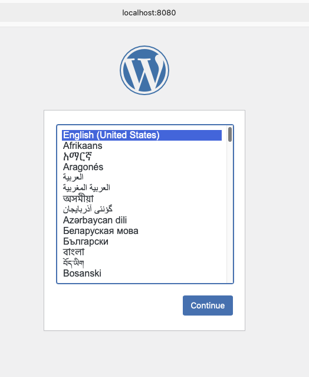

Just a docker container that runs wordpress. It's been done before and it'll be done again I'm sure. 

You'll need an `.env` file to contain some information or pipe it in elsewhere
```
MYSQL_DB_HOST=localhost
MYSQL_ROOT_PASSWORD=rootpassword
MYSQL_DATABASE=mydb
MYSQL_USER=myuser
MYSQL_PASSWORD=mypassword
CONTAINER_NAME=wordpress_mama
DOCKER_IMAGE_NAME=wordpress_image
``` 

Then start it up
`bash ./build_wp_and_run.sh`

THis open a browser
[http://localhost:8080](http://localhost:8080) 

